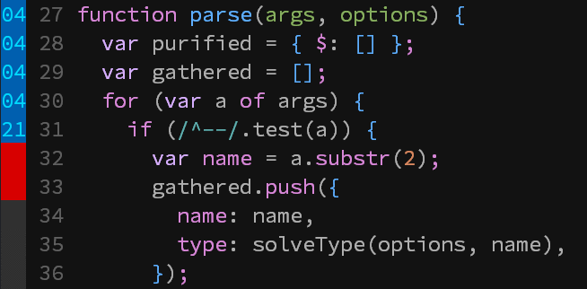

# istanbul.vim



Code coverage visualizer for [istanbul](https://www.npmjs.com/package/istanbul)
`coverage.json`

Works on Linux, Windows and Mac OS.

DOES NOT require python. 100% VimL. :sparkles:

## Install (Pathogen)

```
git clone https://github.com/retorillo/istanbul.vim.git ~/.vim/bundle/istanbul.vim
```

## Commands

### Istanbul

`Istanbul` command enable(or update) signs of current buffer from 'coverage/coverage.js'

```
:wall | !npm test | Istanbul
```

### IstanbulClear

`IstanbulClear` command clear all signs of current buffer

```
:IstanbulClear
```

## License

Distributed under the MIT license

Copyright (C) 2016 Retorillo

